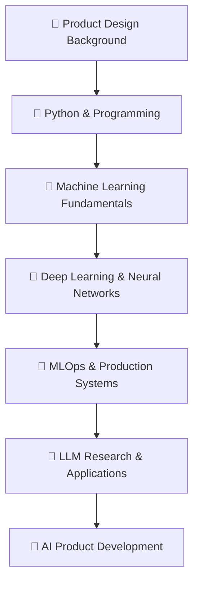

# 🚀 Welcome to My Digital Universe

<div align="center">
  


</div>

---

## 🎭 **The Transformation Story**

```ascii
  Product Designer  ────────────────────▶  AI Researcher
       🎨                                      🤖
    UI/UX Magic                            ML/LLM Wizardry
```

From crafting pixel-perfect interfaces to training neural networks, I'm on an epic journey of **digital metamorphosis**. Currently deep-diving into the fascinating world of **Artificial Intelligence**, **Machine Learning Operations**, and **Large Language Models**.

---

## ⚡ **Current Mission: AI Domination**

<table>
<tr>
<td width="50%">

### 🧠 **Learning Arsenal**
- 🐍 **Python** - The serpent that powers AI
- 🤖 **Machine Learning** - Teaching machines to think
- 🔧 **MLOps** - Productionizing AI at scale  
- 🧪 **LLMs** - Conversing with the future
- 📊 **Data Science** - Mining insights from chaos

</td>
<td width="50%">

### 🎯 **Skill Stack Evolution**
```python
class BiKidsX:
    def __init__(self):
        self.past = ["Product Design", "UI/UX"]
        self.present = ["Python", "ML", "Code"]
        self.future = ["AI Research", "MLOps", "LLMs"]
    
    def transform(self):
        return "Designer → AI Researcher"
```

</td>
</tr>
</table>

---

## 🌟 **What Drives Me**

<div align="center">

| 🎨 **Design** | 🤖 **AI/ML** | 💻 **Code** |
|:-------------:|:------------:|:-----------:|
| Crafting experiences that matter | Building intelligence that learns | Writing poetry in Python |

</div>

---

## 📊 **GitHub Analytics**

<div align="center">

[](https://github.com/bikidsx)


[](https://git.io/streak-stats)

</div>

---

## 🛠️ **Tech Arsenal**

<div align="center">

### **Programming Languages**


### **AI/ML Frameworks**


### **Data Science Stack**


### **Design & Development Tools**


### **Cloud & MLOps**


</div>

---

## 🎯 **2024 Goals & Milestones**

```python
class Goals2024:
    def __init__(self):
        self.learning_goals = [
            "🎓 Master Deep Learning Architectures",
            "🔧 Build Production MLOps Pipelines", 
            "🧠 Fine-tune Large Language Models",
            "🚀 Contribute to Open Source AI Projects"
        ]
        
        self.projects = [
            "AI-powered Design Assistant",
            "Music Generation with ML",
            "End-to-end MLOps Platform",
            "LLM-based Code Assistant"
        ]
    
    def current_progress(self):
        return "🔄 Continuously Learning & Building"
```

---

## 📈 **Current Focus Areas**

<div align="center">



</div>

---

## 🌊 **Recent Projects & Contributions**

### 🎵 **AI Music Generator**
- Built a neural network that generates melodies based on mood inputs
- **Tech Stack:** Python, TensorFlow, MIDI processing, Streamlit
- **Status:** 🚧 In Development

### 🎨 **Design-to-Code AI Assistant**
- Developing an AI tool that converts Figma designs to production code
- **Tech Stack:** Computer Vision, LLMs, React, Python
- **Status:** 🔬 Research Phase

### 📊 **MLOps Pipeline Automation**
- Created automated ML training and deployment workflows
- **Tech Stack:** Docker, MLflow, GitHub Actions, AWS
- **Status:** ✅ Production Ready

---

## 🏆 **Achievements & Recognition**

- 🎯 **Career Pivot:** Successfully transitioning from 5+ years in Product Design to AI Research
- 📚 **Continuous Learning:** Completed 10+ AI/ML courses and certifications
- 🤝 **Community Contributor:** Active in AI/ML communities and open-source projects
- 🎵 **Creative Technologist:** Blending artistic background with technical skills

---

## 📚 **Learning Resources & Inspirations**

### **Currently Reading/Studying:**
- 📖 "Hands-On Machine Learning" by Aurélien Géron
- 🎓 Stanford CS229 Machine Learning Course
- 📺 3Blue1Brown Neural Networks Series
- 📝 Papers from major AI conferences (NeurIPS, ICML, ICLR)

### **Favorite AI/ML Blogs & Resources:**
- 🧠 Distill.pub for visual explanations
- 🤖 Papers With Code for latest research
- 📊 Towards Data Science on Medium
- 🎯 Fast.ai for practical deep learning

---

## 🌍 **Let's Connect & Collaborate**

<div align="center">

[](https://twitter.com/_bikids)
[](https://linkedin.com/in/bikidsx)
[](https://bikidsx.dev)
[](mailto:hello@bikidsx.dev)

### **Open for:**
- 🤝 **Collaboration** on AI/ML projects
- 💼 **Opportunities** in AI Research or ML Engineering
- 🎓 **Mentorship** in career transitions
- 💡 **Innovation Projects** combining design and AI

</div>

---

<div align="center">

### 💭 *"From pixels to parameters, from mockups to models - every line of code is a step toward the future."*


⭐ **Star my repos if you find them interesting!**  
🤝 **Let's build something amazing together**  
🚀 **The future is AI, and we're writing it one algorithm at a time**

</div>

---

<details>
<summary>🎨 <b>Fun Fact: The Power of Design Thinking in AI</b></summary>

<br>

**Why Design Thinking + AI = Innovation:**

My design background brings a unique perspective to AI development:

- 🎯 **User-Centered AI:** Building AI systems that prioritize user experience
- 🧠 **Visual Problem Solving:** Using design thinking to approach complex ML problems
- 🔍 **Empathy-Driven Development:** Understanding user needs before building solutions
- 🎨 **Aesthetic Intelligence:** Creating AI that doesn't just work, but feels intuitive

**Current Design-AI Projects:**
- 🎨 AI-powered design system generators
- 🖼️ Computer vision for design asset recognition  
- 📱 Intelligent UI/UX optimization tools
- 🎯 User behavior prediction models

*"Great AI isn't just about algorithms—it's about understanding humans and creating experiences that feel magical."*

**Design Philosophy for AI:**
- 🔄 Iterate fast, validate often
- 🎯 Focus on real user problems
- 🎨 Make complex technology feel simple
- 🤝 Bridge the gap between human intuition and machine intelligence

</details>

---

<div align="center">

**🔮 What's Next?**

The journey from designer to AI researcher is just the beginning. My goal is to bridge the gap between human creativity and artificial intelligence, creating tools and experiences that amplify human potential rather than replace it.

*Stay tuned for the adventure!* 🚀

---

*Last Updated: September 2024*

</div>
